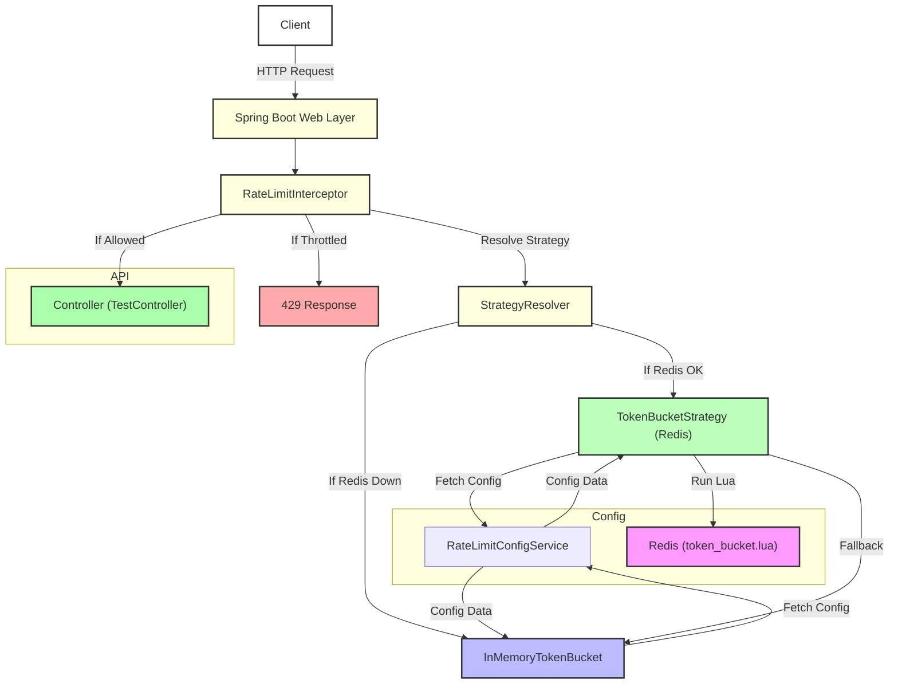

# High-Level Design (HLD): RateLimiter System

## Overview
This document describes the high-level architecture and relationships between the main components of the RateLimiter system.

## Mermaid Diagram

## Textual Summary
- **Client** sends HTTP requests to the application.
- **Spring Boot Web Layer** receives the request.
- **RateLimitInterceptor** intercepts each request to enforce rate limiting.
- **StrategyResolver** determines which rate limiting strategy to use:
    - **TokenBucketStrategy (Redis)** is used if Redis is available.
    - **InMemoryTokenBucket** is used as a fallback if Redis is down or the circuit breaker is open.
- **RateLimitConfigService** provides rate limit configuration for each client and API path.
- **TokenBucketStrategy** executes a Lua script (**token_bucket.lua**) in Redis to enforce rate limits.
- If the request is allowed, it proceeds to the **Controller** (e.g., TestController).
- If the request is throttled, a **429 Response** is returned to the client. 